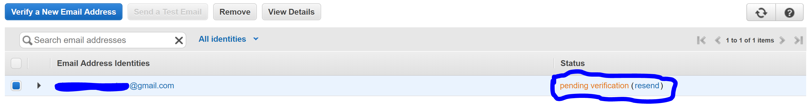
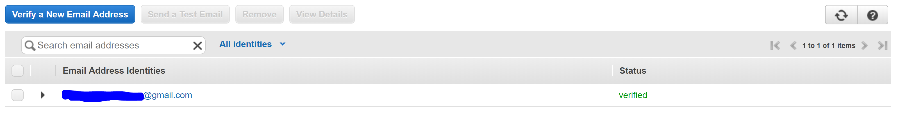

# How to setup an email address in AWS SES (Simple Email Service)

The setup allows for emails to be sent from and/or to this address.

- [AWS Console Setup](#aws-console-setup)
- [AWS CLI Setup](#aws-cli-setup)

## AWS Console Setup

1. In the AWS Console ensure the Region is set to US East (N. Virginia), US West (Oregon) or Europe Ireland (SES is supported only in these regions)
2. Type **_ses_** in the Services search box and select Simple Email Service
3. Click the **_Email Addresses_** link on the menu on the left
3. Click the **_Verify a New Email Address_** button
4. Enter the email you want to send emails to and/or from and push the **_Verify This Email Address_** button
5. The SES email list should show the new email in **_pending verification_** 
6. In the email's inbox you should have an email with the subject **_Amazon Web Services - Email Address Verification Request in region &lt;selected region from the console&gt;_**. Use the resend link in the SES emails list to resend the email if you did not receive it (or check the junk folder).
7. Click the verification link
8. The email should have now its status changed to **_verified_** 
9. The email address is ready to be used to send/receive SmartThings reports/alerts emails.

## AWS CLI Setup

Prerequisites:
- AWS CLI is installed
- AWS CLI is configured to interact with the appropriate account/region where the email addresses are to setup
- The credentials used by the AWS CLI have the permissions to perform SES actions (e.g. ses:*)

Execute the following CLI commands/perform tasks - change **_user@example.com_** to the appropriate address:
 
1. Initiate email verification: _aws ses verify-email-identity --email-address **user@example.com**_
2. In the email's inbox you should have an email with the subject **_Amazon Web Services - Email Address Verification Request in region &lt;selected region from the console&gt;_**. 
3. Click the verification link
4. Check the email verification status: _aws ses get-identity-verification-attributes --identities **user@example.com**_
5. If the Verification Status in the response is Success the email address is ready to be used to send/receive SmartThings reports/alerts emails.