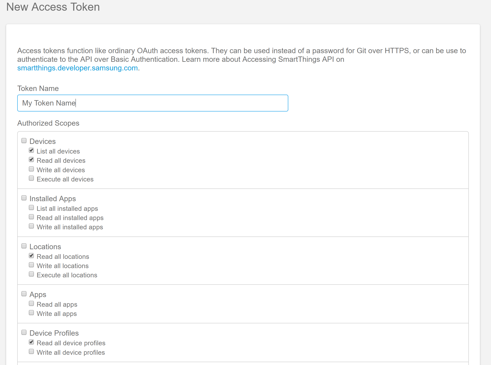
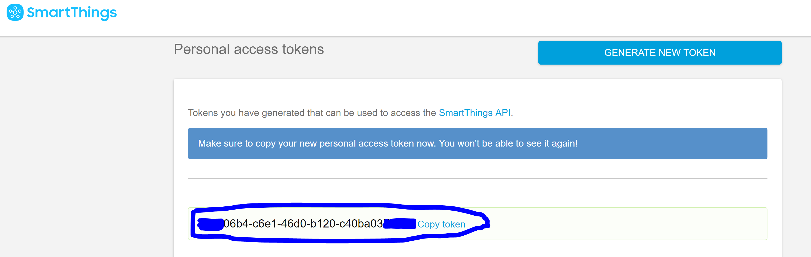

# How to Create a SmartThings API Key

Prerequisites:

- You need to have a SmartThings account with admin role

1. Log in to the [SmartThings/Samsung Account](https://account.smartthings.com/login)
2. Once logged in you should be taken to the [Personal access tokens](#https://account.smartthings.com/tokens)
3. Click the _**GENERATE NEW TOKEN**_ button
4. Provide some name for your token
5. The execution of the AWS Smart Things Serverless apps requires a few _Read-Only_ permissions. Select these scopes:
Devices (List all devices,Read all devices), Locations (Read all locations), Devices Profiles (Read all device profiles)

    

6. Click at the bottom on the **_GENERATE TOKEN_** button
7. Copy the token that shows up and keep it in a secure place. It will be needed for setting up the AWS Serverless App. 
_The token cannot be accessed later from the SmartThins Personal Tokens page._

    

